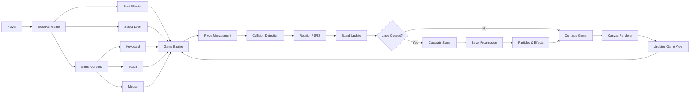
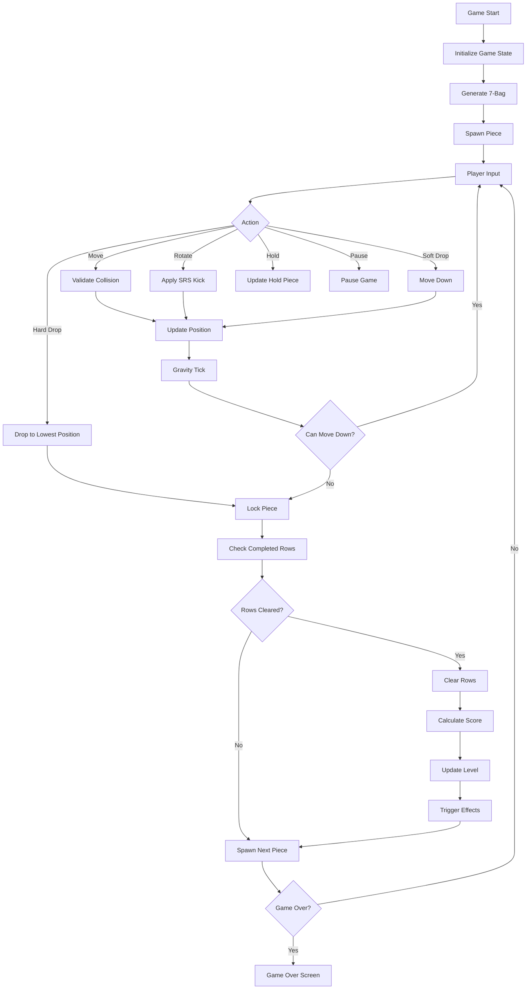
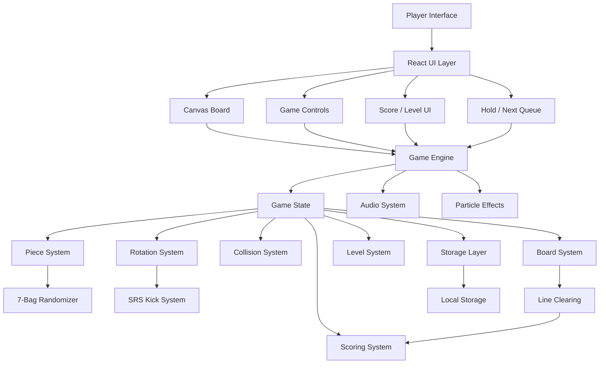
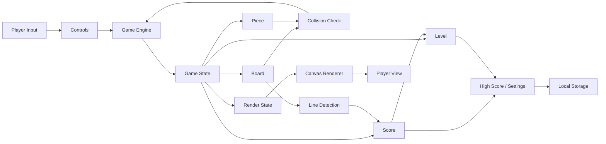
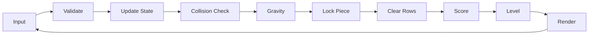

## Product Flow

```mermaid
flowchart LR
    A[Player] --> B[BlockFall Game]

    B --> C[Start / Restart]
    B --> D[Select Level]
    B --> E[Game Controls]

    E --> F[Keyboard]
    E --> G[Touch]
    E --> H[Mouse]

    C --> I[Game Engine]
    D --> I
    F --> I
    G --> I
    H --> I

    I --> J[Piece Management]
    J --> K[Collision Detection]
    K --> L[Rotation / SRS]
    L --> M[Board Update]

    M --> N{Lines Cleared?}

    N -->|No| O[Continue Game]
    N -->|Yes| P[Calculate Score]

    P --> Q[Level Progression]
    Q --> R[Particles & Effects]
    R --> O

    O --> S[Canvas Renderer]
    S --> T[Updated Game View]

    T --> I
```

## Game Flow

```mermaid
flowchart TD
    A[Game Start] --> B[Initialize Game State]
    B --> C[Generate 7-Bag]
    C --> D[Spawn Piece]

    D --> E[Player Input]
    E --> F{Action}

    F -->|Move| G[Validate Collision]
    F -->|Rotate| H[Apply SRS Kick]
    F -->|Soft Drop| I[Move Down]
    F -->|Hard Drop| J[Drop to Lowest Position]
    F -->|Hold| K[Update Hold Piece]
    F -->|Pause| L[Pause Game]

    G --> M[Update Position]
    H --> M
    I --> M
    J --> N[Lock Piece]

    M --> O[Gravity Tick]
    O --> P{Can Move Down?}

    P -->|Yes| E
    P -->|No| N

    N --> Q[Check Completed Rows]
    Q --> R{Rows Cleared?}

    R -->|No| S[Spawn Next Piece]
    R -->|Yes| T[Clear Rows]

    T --> U[Calculate Score]
    U --> V[Update Level]
    V --> W[Trigger Effects]
    W --> S

    S --> X{Game Over?}

    X -->|No| E
    X -->|Yes| Y[Game Over Screen]
```

## Architecture Flow

```mermaid
flowchart TB
    A[Player Interface]

    A --> B[React UI Layer]

    B --> C[Canvas Board]
    B --> D[Game Controls]
    B --> E[Score / Level UI]
    B --> F[Hold / Next Queue]

    C --> G[Game Engine]
    D --> G
    E --> G
    F --> G

    G --> H[Game State]

    H --> I[Board System]
    H --> J[Piece System]
    H --> K[Collision System]
    H --> L[Rotation System]
    H --> M[Scoring System]
    H --> N[Level System]

    J --> O[7-Bag Randomizer]
    L --> P[SRS Kick System]

    I --> Q[Line Clearing]
    Q --> M

    G --> R[Audio System]
    G --> S[Particle Effects]

    H --> T[Storage Layer]
    T --> U[Local Storage]
```

## Data Flow

```mermaid
flowchart LR
    A[Player Input] --> B[Controls]
    B --> C[Game Engine]
    C --> D[Game State]

    D --> E[Board]
    D --> F[Piece]
    D --> G[Score]
    D --> H[Level]

    E --> I[Collision Check]
    F --> I
    I --> C

    E --> J[Line Detection]
    J --> G
    G --> H

    D --> K[Render State]
    K --> L[Canvas Renderer]

    L --> M[Player View]

    G --> N[High Score / Settings]
    H --> N
    N --> O[Local Storage]
```

## Core Game Cycle

```mermaid
flowchart LR
    A[Input] --> B[Validate]
    B --> C[Update State]
    C --> D[Collision Check]
    D --> E[Gravity]
    E --> F[Lock Piece]
    F --> G[Clear Rows]
    G --> H[Score]
    H --> I[Level]
    I --> J[Render]
    J --> A
```
