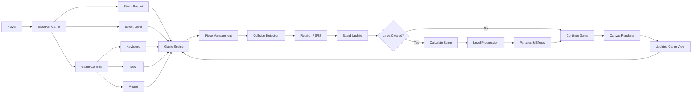
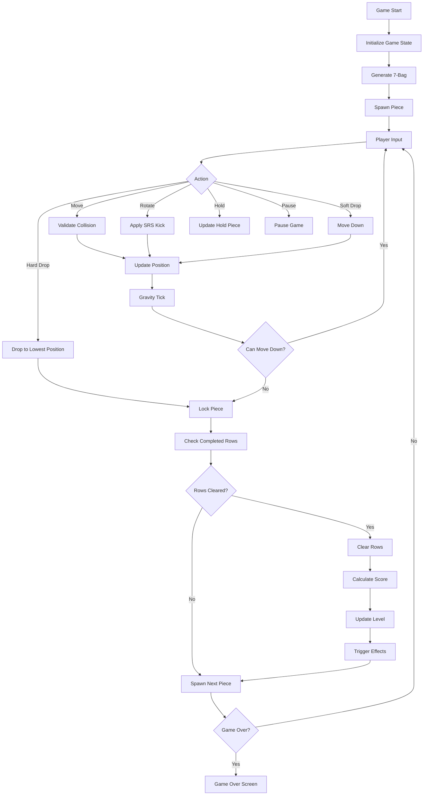
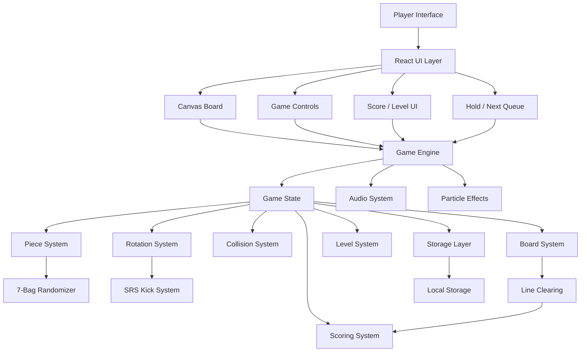
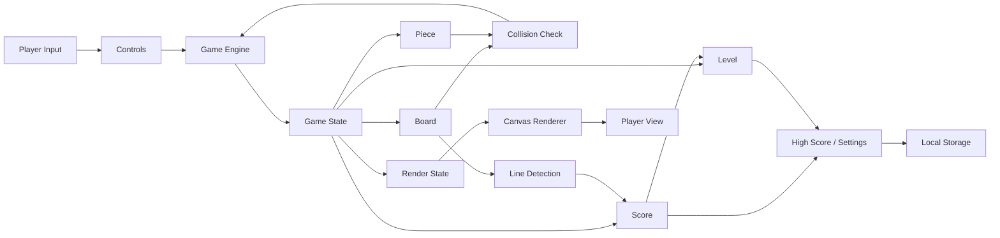
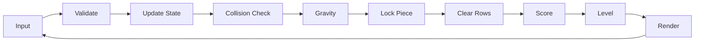

<p align="center">
  <strong>BlockFall — Web Falling-Block Puzzle Game</strong>
</p>

<p align="center">
  <a href="https://github.com/Devputta/Drafts-might-be-needed-/blob/main/LOGO/Gemini_Generated_Image_1ppnm1ppnm1ppnm1%20(1).jfif" target="_blank" rel="noopener noreferrer">
    
  </a>
</p>

<p align="center">
  <strong>
    A browser-based falling-block puzzle game built with React and TypeScript,
    featuring responsive controls, fair piece generation, progressive levels,
    SRS rotation, scoring, audio feedback, and arcade-style visual effects.
  </strong>
</p>

<p align="center">
  <a href="https://github.com/Devputta/BackFall">
    
  </a>
  
  
  
  
  
</p>

---

## 🎮 Overview

**BlockFall** is a single-player browser-based falling-block puzzle game designed around a lightweight game engine and responsive canvas rendering.

The game separates core gameplay logic from the user interface so that movement, collision detection, rotation, scoring, piece generation, and board updates can be tested independently from the browser UI.

The gameplay system includes:

* Deterministic game-state management
* 7-bag tetromino randomization
* Super Rotation System (SRS)
* Progressive gravity levels
* Line-clear scoring
* Hold and next-piece systems
* Keyboard, mouse, and touch controls
* Canvas-based rendering
* Web Audio API sound generation
* Particle and screen-shake effects
* Local persistence for settings and records
* Error handling for UI failures

---

## ✨ Features

### 🎯 Game Engine

* Independent TypeScript game engine
* UI-independent gameplay logic
* Centralized game state management
* Deterministic state transitions
* Collision and boundary validation
* Gravity-based automatic piece movement
* Ghost-piece calculation
* Piece locking and row clearing

### 🎲 7-Bag Randomizer

BlockFall uses a **7-bag randomizer** to provide a more balanced distribution of tetrominoes.

Each bag contains:

```text
I · O · T · S · Z · J · L
```

The pieces are shuffled before being consumed and a new bag is generated after the current bag is exhausted.

This reduces long piece droughts and provides a more predictable arcade experience.

### 🔄 Super Rotation System

The rotation system supports:

* Clockwise rotation
* Counter-clockwise rotation
* SRS wall kicks
* Standard tetromino rotation states
* Separate handling for the `I` piece
* Rotation collision validation

Supported pieces:

```text
I · O · T · S · Z · J · L
```

### 💥 Line-Clear Effects

When rows are cleared, BlockFall can trigger:

* Particle effects
* Star effects
* Floating score notifications
* Screen shake
* Audio feedback
* Level progression

Example score messages:

```text
+100 SINGLE!
+300 DOUBLE!
+500 TRIPLE!
★ +800 TETRIS! ★
```

### 📈 Progressive Levels

The game supports more than **30 progressive levels**.

Gravity increases as the player advances.

| Level | Approx. Gravity |
| ----: | --------------: |
|     1 |          800 ms |
|     5 |     Progressive |
|    10 |     Progressive |
|    15 |     Progressive |
|    20 |     Progressive |
|    25 |     Progressive |
|    30 |           20 ms |

Players can also select a starting level for faster gameplay.

Available starting levels include:

```text
1 · 5 · 10 · 15 · 20
```

### 🎮 Responsive Controls

The game supports:

* Keyboard controls
* Touch controls
* Mouse interaction
* Swipe gestures
* Double-tap hard drop
* Mobile D-pad controls

The interface adapts to different screen sizes without requiring a separate mobile application.

### 🔊 Audio

Arcade-style sounds are generated using the **Web Audio API**.

No external audio files are required.

Audio events include:

* Piece movement
* Rotation
* Hard drop
* Line clear
* Level progression
* Game events

### 🖥️ Customizable Layout

The game provides multiple board sizing options:

* **Compact** — 240px
* **Normal** — 320px
* **Large** — 440px

A fullscreen mode is also supported through the browser's Fullscreen API.

### 🛡️ Data & Error Handling

The application includes:

* Sanitized localStorage parsing
* Numeric bounds checking
* Safe persisted-state handling
* Prototype-injection protection
* React error boundary
* No use of `eval`
* TypeScript type boundaries

---

# 🕹️ Controls

| Action                       | Keyboard        | Touch / Gesture         | Mouse                  |
| :--------------------------- | :-------------- | :---------------------- | :--------------------- |
| **Move Left**                | `←` / `A`       | Tap left side           | Click left side        |
| **Move Right**               | `→` / `D`       | Tap right side          | Click right side       |
| **Rotate Clockwise**         | `↑` / `W` / `X` | Tap upper area          | Right-click / top area |
| **Rotate Counter-Clockwise** | `Z`             | CCW button              | —                      |
| **Soft Drop**                | `↓` / `S`       | Tap bottom area         | Click bottom area      |
| **Hard Drop**                | `Space`         | Double-tap / swipe down | Hard Drop button       |
| **Hold Piece**               | `C` / `Shift`   | Hold button             | Hold button            |
| **Pause / Resume**           | `P` / `Esc`     | Pause button            | Pause button           |
| **Restart**                  | `R`             | Restart option          | Restart button         |

---

# 🏆 Scoring System

BlockFall calculates line-clear points using the active level.

### Formula

```text
Points = Base Points × Current Level
```

| Cleared Lines | Base Score | Level 1 | Level 10 | Level 20 |
| :------------ | ---------: | ------: | -------: | -------: |
| **Single**    |        100 |     100 |    1,000 |    2,000 |
| **Double**    |        300 |     300 |    3,000 |    6,000 |
| **Triple**    |        500 |     500 |    5,000 |   10,000 |
| **Tetris**    |        800 |     800 |    8,000 |   16,000 |

Additional scoring:

```text
Soft Drop  → 1 point per cell
Hard Drop  → 2 points per cell
```

---

# 🔄 Project Flow

## Product Flow



## Game Flow



## Architecture Flow



## Data Flow



## Core Game Cycle



---

# 🧩 Core Modules

| Module              | Responsibility                                                     |
| ------------------- | ------------------------------------------------------------------ |
| **Game Engine**     | Controls the main game state and lifecycle                         |
| **Board**           | Handles grid state, piece locking, ghost pieces, and line clearing |
| **Collision**       | Validates movement against boundaries and occupied cells           |
| **Rotation**        | Handles piece rotation and SRS wall kicks                          |
| **7-Bag**           | Generates balanced tetromino sequences                             |
| **Scoring**         | Calculates line-clear and drop points                              |
| **Controls**        | Handles keyboard, mouse, touch, DAS, and ARR behavior              |
| **Audio**           | Generates arcade effects using Web Audio API                       |
| **Canvas Renderer** | Draws board, pieces, animations, and particles                     |
| **Storage**         | Persists scores and user settings safely                           |
| **Error Boundary**  | Prevents UI crashes from producing a blank application             |

---

# 📁 Project Structure

```text
BlockFall/
│
├── index.html
├── metadata.json
├── package.json
├── tsconfig.json
├── vite.config.ts
├── .env.example
├── .gitignore
├── LICENSE
├── SECURITY.md
├── README.md
│
└── src/
    │
    ├── components/
    │   ├── CanvasBoard.tsx
    │   ├── HoldPanel.tsx
    │   ├── NextQueuePanel.tsx
    │   ├── ScorePanel.tsx
    │   ├── MobileControls.tsx
    │   ├── ErrorBoundary.tsx
    │   ├── GameOverModal.tsx
    │   └── PauseModal.tsx
    │
    ├── game/
    │   ├── audio.ts
    │   ├── bag.ts
    │   ├── board.ts
    │   ├── collision.ts
    │   ├── constants.ts
    │   ├── gameEngine.ts
    │   ├── pieces.ts
    │   ├── rotation.ts
    │   ├── scoring.ts
    │   ├── srsKicks.ts
    │   ├── types.ts
    │   └── useControls.ts
    │
    ├── lib/
    │   └── storage.ts
    │
    └── tests/
        ├── engine.test.ts
        └── runTests.ts
```

---

# 🧪 Testing

The project contains a headless test suite for validating core game-engine behavior without relying on browser rendering.

Current test status:

```text
12 / 12 Tests Passing
```

The tests cover core areas such as:

* Piece generation
* Movement
* Collision
* Rotation
* Board behavior
* Row clearing
* Scoring
* Game-state transitions

Test runner:

```text
src/tests/runTests.ts
```

---

# 🔐 Security

Security considerations are documented in:

**[SECURITY.md](SECURITY.md)**

The project follows several defensive practices:

* Sanitized localStorage parsing
* Numeric bounds validation
* Safe persisted-state handling
* Prototype-injection prevention
* No arbitrary `eval()` execution
* TypeScript type boundaries
* React Error Boundary protection
* Controlled browser APIs
* No secrets committed to source control

Environment-specific values should be stored outside the repository and represented through `.env.example` when required.

---

# ⚙️ Technical Stack

### Frontend

* React 19
* TypeScript 5.x
* Vite 8.x
* HTML5 Canvas
* CSS

### Game Systems

* Custom TypeScript game engine
* 7-bag randomizer
* SRS rotation
* Collision detection
* Gravity system
* Scoring system
* Level progression
* Hold queue
* Next-piece queue

### Browser APIs

* Canvas API
* Web Audio API
* Fullscreen API
* LocalStorage
* Pointer / Touch Events
* Keyboard Events

### Development

* Git
* GitHub
* TypeScript
* Vite
* Headless test runner

---

# 📱 Responsive Design

BlockFall is designed to work across:

```text
Desktop
   │
   ├── Keyboard
   ├── Mouse
   └── Fullscreen
        │
        ▼
Tablet
   │
   └── Touch Controls
        │
        ▼
Mobile
   │
   ├── Touch D-Pad
   ├── Tap Zones
   ├── Swipe
   └── Double-Tap
```

The interface adjusts the board and controls based on available screen space.

---

# 📊 Design Principles

The project is structured around several core principles:

### Separation of Concerns

Game logic remains independent from the React interface.

### Deterministic State

Gameplay state is managed through predictable state transitions.

### Testability

Core gameplay systems can be tested without browser rendering.

### Responsive Interaction

Controls are designed for keyboard, mouse, and touch devices.

### Lightweight Runtime

The game avoids unnecessary external runtime dependencies for audio and core gameplay systems.

### Defensive Data Handling

Persisted browser data is validated before being used by the game.

---

# 👤 Project

**BlockFall** is developed and maintained by **[Devputta](https://github.com/Devputta)**.

Repository:

**https://github.com/Devputta/BackFall**

---


# 📄 License

This project is licensed under the **Apache License 2.0**.

See the [LICENSE](LICENSE) file for the complete license text.

---

<p align="center">
  <strong>BlockFall</strong>
  <br />
  A browser-based falling-block puzzle game.
</p>

<p align="center">
  <em>Build. Play. Clear. Repeat.</em>
</p>
